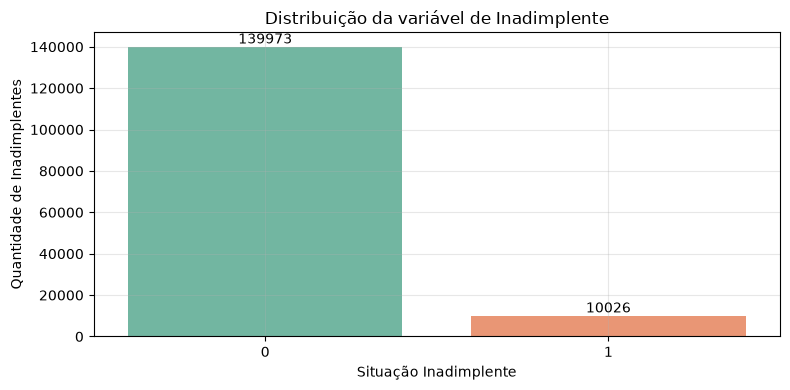
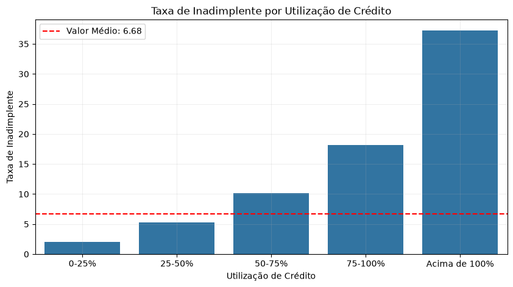
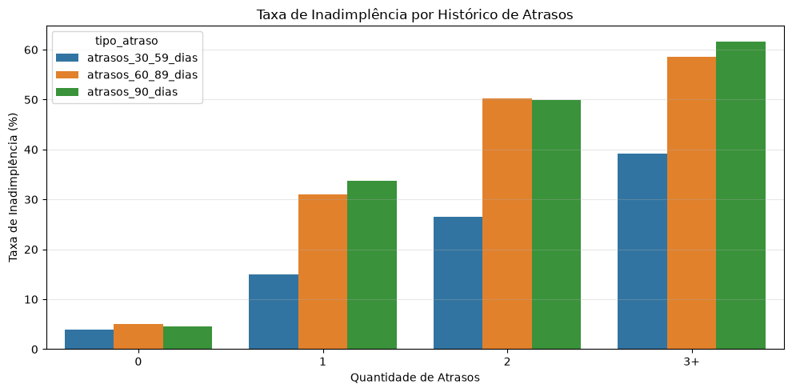
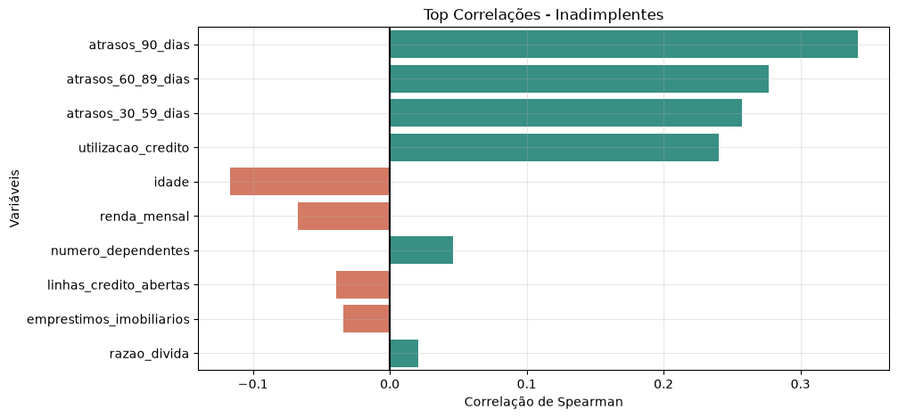
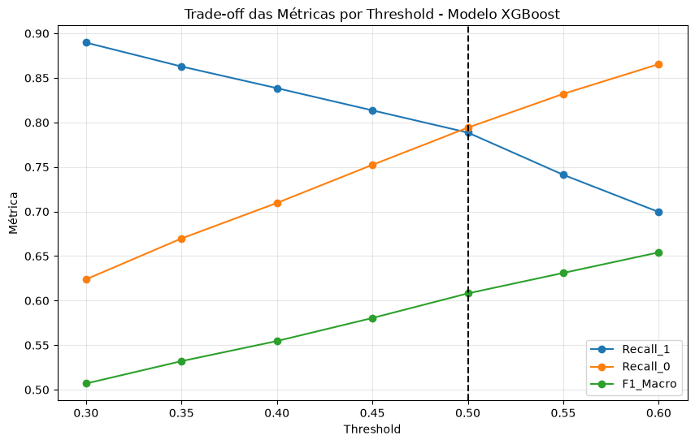
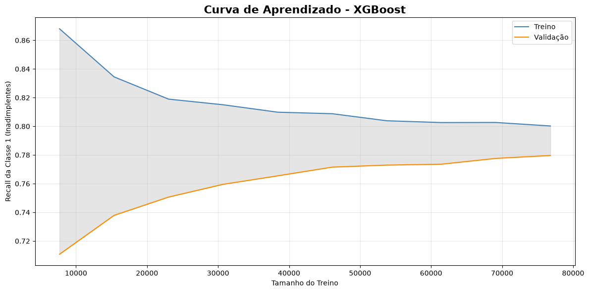
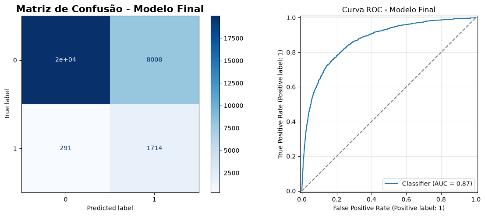
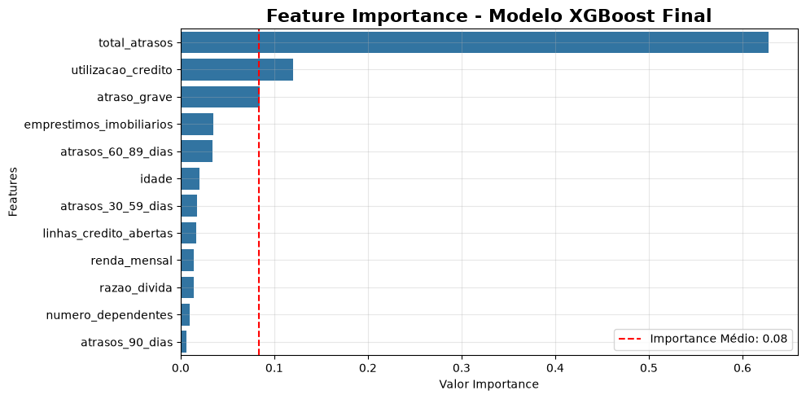
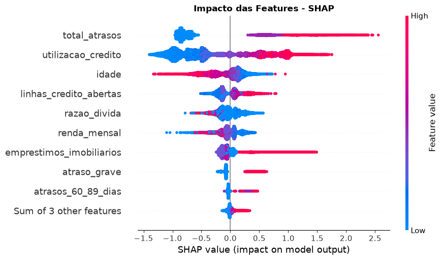
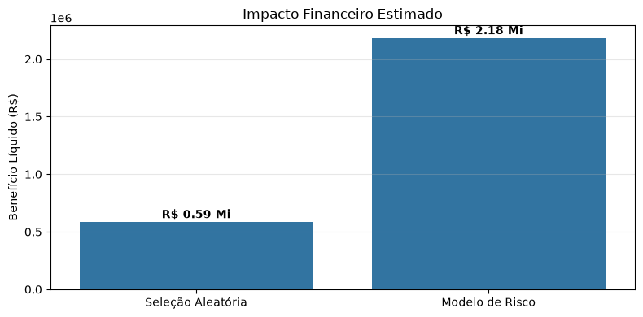

# Credit Risk Intelligence — Modelagem de Risco de Crédito

Projeto de Ciência de Dados que conecta análise exploratória, Machine Learning e uma aplicação interativa para identificar e priorizar clientes com maior risco de inadimplência.

O trabalho percorre a preparação da base, a comparação de seis classificadores, a otimização de hiperparâmetros, a escolha do limiar de decisão e a interpretação das previsões com SHAP. Uma aplicação em Streamlit transforma o modelo em uma experiência de análise de carteira e avaliação individual.

No conjunto de teste, o **XGBoost com limiar 0,40 identificou 85,5% dos inadimplentes ao sinalizar 32,4% da carteira**. Essa capacidade de detecção vem acompanhada de precisão de **17,6%**: o projeto explora justamente a relação entre alcançar clientes de risco e administrar o volume de falsos alertas.

| Indicador no teste | Resultado |
| :--- | ---: |
| Clientes avaliados | 30.000 |
| Inadimplentes identificados | 1.714 de 2.005 |
| Recall da classe 1 | **85,49%** |
| Precisão da classe 1 | **17,63%** |
| ROC AUC | **0,8691** |
| Carteira sinalizada | **32,41%** |

**Navegação:** [Dados](#1-dados-e-preparação) · [Análise exploratória](#2-o-que-os-dados-revelam) · [Modelagem](#3-estratégia-de-modelagem) · [Resultados](#6-avaliação-no-teste) · [Impacto financeiro](#8-impacto-financeiro-potencial) · [Aplicação](#9-aplicação-interativa) · [Execução](#11-como-executar)

---

## Objetivo do Projeto

> Como concentrar ações preventivas em uma parcela da carteira e, ainda assim, alcançar a maior parte dos clientes que apresentarão inadimplência?

O problema é tratado como uma classificação binária, com foco na identificação da classe minoritária. Além de comparar métricas, o projeto investiga o efeito do limiar de decisão sobre a quantidade de clientes sinalizados e traduz as previsões em uma simulação de valor para o negócio.

A aplicação demonstra uma estratégia de **priorização para análise e atuação preventiva**. Os resultados não constituem uma política validada de aprovação ou recusa de crédito.

---

## 1. Dados e Preparação

Notebook: [01_preparando_dataset.ipynb](notebooks/01_preparando_dataset.ipynb)

A base local, `data/risk_credit.csv`, contém **150.000 registros e 10 atributos explicativos**. Seu esquema de variáveis corresponde ao dataset da competição [Give Me Some Credit, no Kaggle](https://www.kaggle.com/c/GiveMeSomeCredit), cujo problema envolve risco de dificuldades financeiras no horizonte de dois anos.

O alvo original, `SeriousDlqin2yrs`, é renomeado para `inadimplente_2_anos`: **1** representa a ocorrência do evento e **0**, sua ausência. Os atributos descrevem utilização de crédito, idade, renda, endividamento, linhas de crédito, dependentes e histórico de atrasos.

| Etapa ou característica | Quantidade |
| :--- | ---: |
| Registros originais | 150.000 |
| Registro removido por idade igual a zero | 1 |
| Registros disponíveis para modelagem | **149.999** |
| Classe 0 — não inadimplentes | 139.973 |
| Classe 1 — inadimplentes | 10.026 |
| Renda mensal ausente | 29.731 — 19,82% |
| Número de dependentes ausente | 3.924 — 2,62% |

Os nomes das colunas são padronizados em português. Os valores ausentes são preservados até a modelagem, quando a mediana é estimada no treino. As **609 linhas repetidas** identificadas na inspeção também permanecem na base; sem um identificador de cliente, atributos iguais não confirmam que se trata da mesma pessoa.

Todos os registros sem informação de dependentes também apresentam renda ausente. Esse padrão, somado às diferenças de endividamento entre grupos, motiva a análise das ausências antes de qualquer exclusão automática.

O resultado é salvo em `data/dados_risk_credit.csv`.

---

## 2. O Que os Dados Revelam

Notebook: [02_analise_exploratoria.ipynb](notebooks/02_analise_exploratoria.ipynb)

### 2.1. Uma classe de interesse pouco frequente

A inadimplência corresponde a **6,68% da base preparada**. Um classificador que sempre previsse a classe 0 teria aproximadamente 93,32% de acurácia, mas não identificaria nenhum inadimplente. Por isso, o desempenho precisa ser observado por classe.



*Classes: 0 = não inadimplente; 1 = inadimplente. O desbalanceamento orienta a estratificação e o uso de pesos no treinamento.*

### 2.2. Utilização do crédito

A mediana de utilização é de aproximadamente **13%** entre não inadimplentes e **84%** entre inadimplentes. Nas faixas analisadas, a taxa do evento cresce de cerca de **2%** para **37,2%** quando a utilização supera 100%.



*A linha vermelha representa a taxa geral de 6,68%. O agrupamento original não inclui registros com utilização exatamente igual a zero.*

O padrão sugere que o comprometimento do limite disponível oferece informação relevante para diferenciar perfis nesta amostra. A associação observada não estabelece uma relação causal.

### 2.3. Histórico de pagamento

A quantidade e a gravidade dos atrasos também se associam à inadimplência. Entre clientes com três ou mais ocorrências, a taxa chega a **58,64%** nos atrasos de 60–89 dias e **61,68%** nos de 90 dias ou mais.



*O gráfico exclui, apenas nesta análise, registros com contagens de atraso iguais ou superiores a 90. Esses valores permanecem na base usada para modelagem.*

### 2.4. Associações e novas variáveis

A correlação de Spearman reforça o papel dos atrasos e da utilização do crédito. A idade apresenta associação negativa com o alvo; os demais atributos têm relações individuais mais fracas, sem que isso descarte sua utilidade em interações ou relações não lineares.



Para sintetizar o histórico de pagamento, são criadas duas variáveis:

| Variável | Construção |
| :--- | :--- |
| `total_atrasos` | Soma das contagens de atrasos de 30–59, 60–89 e 90 dias ou mais |
| `atraso_grave` | Indicador igual a 1 quando existe atraso de 90 dias ou mais |

A base enriquecida, `data/dados_modelo.csv`, contém **12 atributos explicativos e o alvo**. A contribuição incremental das novas variáveis ainda depende de uma comparação controlada de modelos com e sem esses atributos.

---

## 3. Estratégia de Modelagem

Notebook: [03_modelos_machine_learning.ipynb](notebooks/03_modelos_machine_learning.ipynb)

As divisões utilizam estratificação por classe e `random_state=42`:

```text
149.999 registros
       │
       ├── Treino:      95.999  ≈ 64%
       ├── Validação:   24.000  ≈ 16%
       └── Teste:       30.000  ≈ 20%
```

O pré-processamento combina **imputação pela mediana** e **padronização com StandardScaler**, ajustadas no treino e aplicadas aos demais conjuntos. A inspeção com `VarianceThreshold` mantém os 12 atributos; os arrays produzidos por esse seletor não substituem os dados usados nos treinamentos.

São comparados Regressão Logística, Árvore de Decisão, Random Forest, KNN, XGBoost e LightGBM. Pesos de classe são utilizados na maioria dos modelos; no XGBoost, o ajuste ocorre via `scale_pos_weight`. O KNN é avaliado sem ponderação de classes.

| Métrica | Pergunta que ajuda a responder |
| :--- | :--- |
| Recall da classe 1 | Quantos inadimplentes reais foram identificados? |
| Precisão da classe 1 | Quantos clientes sinalizados realmente eram inadimplentes? |
| F1 macro | Como se comporta o equilíbrio entre precisão e recall, dando o mesmo peso às classes? |
| ROC AUC | Qual é a capacidade de ordenar as classes ao variar o limiar? |
| Average Precision | Como se comporta a relação precisão–recall ao longo do ranking? |

O conjunto de validação orienta as comparações e o ajuste do limiar. O teste é utilizado para a avaliação final apresentada a seguir. Como a análise exploratória já consultou a base completa, essa avaliação não equivale a uma validação externa inteiramente independente.

---

## 4. Comparação e Otimização dos Modelos

### 4.1. Comparação inicial

Resultados registrados nas **24.000 observações de validação**, com a decisão padrão de cada estimador:

| Modelo | Acurácia | Precisão — classe 1 | Recall — classe 1 | F1 macro |
| :--- | ---: | ---: | ---: | ---: |
| XGBoost | 83,8% | 24,1% | 66,1% | **0,630** |
| Random Forest | 82,5% | 23,8% | 72,9% | 0,629 |
| LightGBM | 81,4% | 22,7% | 74,6% | 0,620 |
| Regressão Logística | 83,4% | 22,6% | 61,0% | 0,618 |
| KNN | **93,4%** | **52,5%** | 17,6% | 0,615 |
| Árvore de Decisão | 75,3% | 18,7% | **80,5%** | 0,577 |

O KNN exemplifica a limitação da acurácia neste problema: acerta a maior parcela dos registros, mas identifica apenas 17,6% dos inadimplentes. A árvore tem o maior recall inicial, acompanhado de menor precisão e F1 macro. A escolha depende, portanto, do tipo de erro que se pretende reduzir.

### 4.2. Busca de hiperparâmetros

O projeto aprofunda a avaliação de XGBoost, Random Forest e LightGBM com `RandomizedSearchCV`: **15 configurações por modelo e três dobras estratificadas**. Em seguida, Optuna realiza **50 tentativas para XGBoost e 50 para LightGBM**. As buscas maximizam o recall da classe 1.

| Modelo ajustado | Precisão — classe 1 | Recall — classe 1 | F1 macro |
| :--- | ---: | ---: | ---: |
| XGBoost — Optuna | 21,20% | **78,99%** | 0,6047 |
| **XGBoost — RandomizedSearchCV** | **21,54%** | **78,87%** | **0,6081** |
| LightGBM — Optuna | 21,47% | 78,80% | 0,6075 |
| LightGBM — RandomizedSearchCV | 21,81% | 77,62% | 0,6110 |
| Random Forest — RandomizedSearchCV | 23,05% | 76,06% | 0,6227 |

*Comparação no conjunto de validação, antes do ajuste do limiar. O destaque indica o modelo utilizado nas etapas seguintes.*

O fluxo segue com o **XGBoost da busca aleatória**, também encontrado no pipeline salvo. Sua configuração inclui 600 árvores, profundidade máxima 3, taxa de aprendizado 0,03 e regularização. O XGBoost do Optuna apresenta recall ligeiramente maior, mas a diferença de aproximadamente 0,12 ponto percentual não demonstra superioridade estatística.

---

## 5. Limiar de Decisão e Generalização

### 5.1. O efeito de alterar o threshold

O limiar transforma o escore contínuo em uma decisão. Reduzi-lo amplia a detecção de inadimplentes e aumenta a quantidade de clientes sinalizados.

| Limiar | Recall — classe 1 | Precisão — classe 1 | F1 macro |
| :--- | ---: | ---: | ---: |
| 0,30 | 88,97% | 14,49% | 0,5069 |
| **0,40 — adotado** | **83,85%** | **17,14%** | **0,5546** |
| 0,50 | 78,87% | 21,54% | 0,6081 |
| 0,60 | 69,95% | 27,13% | 0,6542 |



*Resultados de validação. A linha vertical do gráfico original marca 0,50 como referência; o limiar aplicado no teste e na aplicação é **0,40**.*

A escolha de 0,40 privilegia a detecção em relação a 0,50. Ela não maximiza o F1 macro entre as alternativas e não foi selecionada por uma otimização de custo financeiro.

### 5.2. Consistência nas divisões de treino

Na validação cruzada com cinco dobras, o XGBoost apresenta **ROC AUC de 0,8637 ± 0,0050** e **recall da classe 1 de 77,89% ± 1,01 ponto percentual**. Esses valores usam a decisão padrão do estimador, sem aplicar o limiar 0,40.



Na maior amostra da curva, o recall é de **80,02% no treino** e **77,96% na validação**, com diferença de **2,06 pontos percentuais**. A aproximação das curvas sugere menor distância entre ajuste e validação à medida que a amostra aumenta, mas não comprova ausência de sobreajuste. A área sombreada representa a distância entre as médias, não um intervalo de confiança.

Há uma limitação metodológica: o pré-processamento é ajustado antes das dobras, e os hiperparâmetros já foram escolhidos com os dados de treino. Assim, essas medidas funcionam como diagnósticos internos; uma avaliação mais rigorosa deve ajustar todo o pipeline dentro de cada dobra.

---

## 6. Avaliação no Teste

Com limiar **0,40**, o modelo apresenta os seguintes resultados nas 30.000 observações reservadas:

| Indicador | Resultado |
| :--- | ---: |
| Recall — classe 1 | **85,49%** |
| Precisão — classe 1 | 17,63% |
| F1 — classe 1 | 0,2923 |
| F1 macro | 0,5602 |
| Acurácia | 72,34% |
| ROC AUC | **0,8691** |
| Average Precision | **0,4006** |



| Resultado da decisão | Clientes |
| :--- | ---: |
| Não inadimplentes corretamente não sinalizados | 19.987 |
| Não inadimplentes sinalizados — falsos positivos | 8.008 |
| Inadimplentes não detectados — falsos negativos | 291 |
| Inadimplentes identificados — verdadeiros positivos | **1.714** |

O modelo concentra **85,5% dos inadimplentes em 32,4% da carteira**. Em contrapartida, aproximadamente 82,4% dos clientes sinalizados não pertencem à classe 1. Esse comportamento sustenta a leitura como ferramenta de triagem, cujo valor depende do custo e da capacidade das ações posteriores.

As contagens foram reproduzidas com o `pipeline_modelo.pkl` disponível no projeto, na mesma divisão estratificada. ROC AUC e Average Precision também foram recalculadas a partir desse artefato. Nos scripts, a chave `pr_auc` corresponde à **Average Precision**, calculada por `average_precision_score`, e não à integração trapezoidal da curva precisão–recall.

---

## 7. Interpretação das Previsões

### 7.1. Importância interna do modelo

O histórico de pagamento domina a importância interna do XGBoost. `total_atrasos` concentra aproximadamente **62,8%**, seguido de `utilizacao_credito` e `atraso_grave`.



Esses percentuais descrevem o critério de importância do estimador. Eles não medem efeitos causais nem representam a porcentagem do risco explicada por cada atributo; variáveis relacionadas podem compartilhar informação.

### 7.2. Explicações com SHAP

O SHAP complementa essa leitura ao mostrar a direção e a magnitude das contribuições para as previsões. No gráfico, valores elevados de `total_atrasos` e `utilizacao_credito` aparecem predominantemente associados a contribuições positivas para a saída do modelo.



*Cada ponto representa uma observação. A posição horizontal indica a contribuição SHAP, e a cor representa valores mais baixos ou mais altos do atributo. Os atributos usados pelo modelo estão padronizados.*

O notebook também inclui dependência de `total_atrasos` e uma explicação individual com waterfall. As contribuições estão na escala da saída explicada pelo modelo, não em pontos percentuais de probabilidade. A calibração dos escores ainda precisa ser avaliada.

---

## 8. Impacto Financeiro Potencial

Para aproximar o resultado preditivo de uma decisão de negócio, o projeto simula ações sobre os **9.722 clientes sinalizados** no teste.

| Premissa hipotética | Valor |
| :--- | ---: |
| Perda média por inadimplente | R$ 5.000 |
| Parcela da perda evitada pela ação | 30% |
| Custo de abordagem por cliente sinalizado | R$ 40 |

O benefício líquido é calculado como:

```text
Benefício líquido = inadimplentes detectados × perda média × efetividade
                    − clientes sinalizados × custo da ação
```



| Resultado da simulação | Valor |
| :--- | ---: |
| Perda potencialmente evitada com o modelo | R$ 2.571.000,00 |
| Custo de todas as abordagens | R$ 388.880,00 |
| Benefício líquido com o modelo | **R$ 2.182.120,00** |
| Benefício líquido esperado com seleção aleatória | R$ 585.750,50 |
| Ganho incremental estimado | **R$ 1.596.369,50** |

A referência aleatória aborda o mesmo número de clientes, com os mesmos custos e efetividade. O ganho incremental vem da maior concentração de inadimplentes no grupo priorizado.

**Os valores são uma simulação, não ganhos realizados.** A base não fornece as perdas e os custos utilizados; os valores em reais foram definidos para o cenário demonstrativo e não estabelecem a moeda original da renda. O cálculo também não incorpora todos os possíveis efeitos de uma ação sobre falsos positivos ou mudanças de comportamento dos clientes.

---

## 9. Aplicação Interativa

Arquivo: [app.py](app.py)

O **Credit Risk Intelligence** utiliza Streamlit e Plotly para conectar o pipeline às análises operacionais.

| Tela | Funcionalidades |
| :--- | :--- |
| **Visão geral** | Indicadores de detecção, parcela da carteira priorizada e simulação de valor incremental |
| **Dashboard da carteira** | Segmentação por faixa de escore, funil, curva de captura, comparação financeira e exportação em CSV |
| **Avaliar cliente** | Formulário com os atributos originais, tratamento de informações ausentes e decisão de priorização |
| **Sobre o projeto** | Apresentação do fluxo analítico, da inferência e das tecnologias |

O dashboard utiliza a divisão de teste de `dados_modelo.csv`. A curva de captura permite observar a concentração de inadimplentes quando os clientes são ordenados por escore: com o artefato atual, os **10% de maior escore concentram cerca de 56,3% dos inadimplentes**; os 20% concentram 73,8%; e os 30%, 83,7%.

Esses recortes por capacidade são diferentes da regra de limiar fixo. Na avaliação individual, a aplicação cria `total_atrasos` e `atraso_grave` automaticamente e aplica a regra **escore ≥ 0,40**.

```text
Dados do cliente → Variáveis derivadas → Imputação e padronização
                                                ↓
                                         XGBoost ajustado
                                                ↓
                                     Escore → Limiar 0,40
                                                ↓
                                      Priorizar / Não priorizar
```

As faixas de risco da interface são segmentos de escore. Não representam probabilidades calibradas nem categorias validadas de uma política de crédito.

---

## 10. Estrutura e Artefatos

```text
credit-risk-modeling/
├── assets/
│   └── images/                          # Gráficos deste README
├── data/
│   ├── risk_credit.csv                  # Base original
│   ├── dados_risk_credit.csv            # Base preparada
│   └── dados_modelo.csv                 # Base com variáveis derivadas
├── models/
│   └── pipeline_modelo.pkl             # Preprocessador + XGBoost
├── notebooks/
│   ├── 01_preparando_dataset.ipynb
│   ├── 02_analise_exploratoria.ipynb
│   └── 03_modelos_machine_learning.ipynb
├── src/
│   ├── modeling/
│   │   ├── train.py                     # Reajuste de um pipeline existente
│   │   └── predict.py                   # Inferência com limiar 0,40
│   ├── evaluation/
│   │   └── metrics.py                   # Avaliação no teste estratificado
│   └── visualization/
│       └── plots.py                     # Matrizes e curvas de avaliação
├── app.py                              # Aplicação Streamlit
├── requirements.txt
├── .gitignore
└── README.md
```

O pipeline salvo recebe **12 atributos, sem padronização prévia**: ele próprio realiza imputação e transformação. A criação das duas variáveis derivadas e a regra de limiar ficam fora do artefato; são aplicadas pelo código que o utiliza. Para reproduzir a decisão do projeto, utiliza-se `predict_proba` e o corte de 0,40.

Os gráficos deste documento foram extraídos das saídas salvas dos notebooks. As tabelas de comparação preservam os experimentos registrados; os indicadores do artefato foram conferidos sem retreinamento.

---

## 11. Como Executar

### 11.1. Preparar o ambiente

O ambiente local do projeto utiliza **Python 3.12**. Os comandos abaixo são para Windows/PowerShell, executados a partir da pasta que receberá o repositório:

```powershell
git clone https://github.com/RenanTrevelim/credit-risk-modeling.git
cd credit-risk-modeling

py -3.12 -m venv .venv
.\.venv\Scripts\python.exe -m pip install -r requirements.txt
.\.venv\Scripts\python.exe -m pip install lightgbm==4.7.0 optuna==5.0.0 plotly==7.1.0 streamlit==1.64.0
```

A instalação complementar é necessária porque **LightGBM, Optuna, Plotly e Streamlit não constam no `requirements.txt` atual**, embora sejam utilizados no projeto. As versões acima correspondem às encontradas no ambiente local. A lista de dependências inclui componentes específicos de Windows e pode exigir adaptação em outros sistemas.

### 11.2. Explorar os notebooks

```powershell
.\.venv\Scripts\python.exe -m jupyterlab
```

Execute os notebooks na ordem **01 → 02 → 03**, mantendo a estrutura de pastas. Eles leem e gravam arquivos com caminhos relativos a `notebooks/`.

| Notebook | Entrada | Saída principal |
| :--- | :--- | :--- |
| 01 — Preparação | `data/risk_credit.csv` | `data/dados_risk_credit.csv` |
| 02 — Exploração | `data/dados_risk_credit.csv` | `data/dados_modelo.csv` |
| 03 — Modelagem | `data/dados_modelo.csv` | `models/pipeline_modelo.pkl` |

Se a base original não estiver disponível na cópia do repositório, obtenha a base de treinamento na página da competição e organize-a como `data/risk_credit.csv`, preservando a coluna de índice e o esquema original. As buscas de hiperparâmetros e a análise SHAP são as etapas mais custosas da execução.

### 11.3. Abrir a aplicação

Com `data/dados_modelo.csv` e `models/pipeline_modelo.pkl` disponíveis:

```powershell
.\.venv\Scripts\python.exe -m streamlit run app.py
```

Abra o endereço local informado pelo Streamlit. O modelo existente permite explorar o dashboard e avaliar clientes sem repetir as buscas de hiperparâmetros.

### 11.4. Executar os scripts auxiliares

A partir da raiz do projeto:

```powershell
# Exibir previsões para uma amostra de cinco registros
.\.venv\Scripts\python.exe src/modeling/predict.py

# Recalcular as métricas do pipeline salvo
.\.venv\Scripts\python.exe src/evaluation/metrics.py

# Exibir matriz de confusão, ROC e curva precisão–recall
.\.venv\Scripts\python.exe src/visualization/plots.py
```

O script `src/modeling/train.py` tem uma finalidade diferente: **carrega um pipeline já existente, reajusta-o em 80% da base e sobrescreve `models/pipeline_modelo.pkl`**. Ele não executa a comparação dos notebooks nem a divisão 64%/16%/20%. Seu uso altera o artefato e pode produzir métricas diferentes das documentadas aqui.

---

## 12. Limitações e Próximos Passos

O projeto conecta exploração, classificação, interpretação e aplicação. Para avançar na validação da solução, os principais pontos são:

- **Isolamento da avaliação:** integrar o pré-processamento à validação cruzada, calcular os pesos apenas no treino e confirmar o desempenho em dados novos, considerando que a exploração consultou a base completa.
- **Qualidade da base:** investigar linhas repetidas e contagens anormais de atraso, que permanecem nos dados de treinamento e nas variáveis derivadas.
- **Calibração e decisão:** avaliar a calibração dos escores e escolher o limiar com custos reais, capacidade operacional e impacto dos falsos positivos.
- **Reprodutibilidade:** completar o arquivo de dependências, passar o sampler com semente ao estudo XGBoost do Optuna e versionar o modelo junto às métricas e às transformações.
- **Generalização:** avaliar estabilidade em novos períodos e segmentos, disponibilidade dos atributos no momento da previsão e eventuais diferenças de desempenho entre grupos.

O resultado atual mostra capacidade de concentrar inadimplentes em uma parcela menor da carteira. O valor operacional dessa priorização depende da confirmação desses resultados e da efetividade das ações adotadas após o alerta.

---

## Tecnologias

**Dados e visualização:** Python, Pandas, NumPy, Matplotlib, Seaborn e Plotly.  
**Modelagem:** Scikit-learn, XGBoost, LightGBM e Optuna.  
**Interpretação e aplicação:** SHAP, Joblib, Jupyter e Streamlit.

## Autor

[Renan Trevelim](https://github.com/RenanTrevelim)
